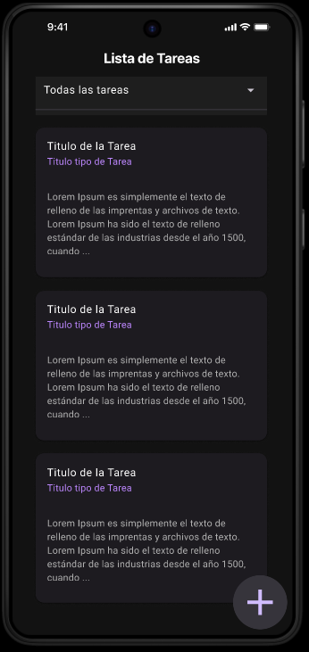
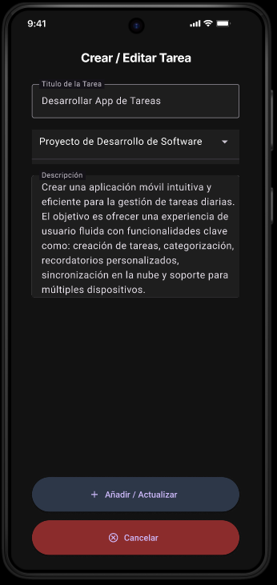
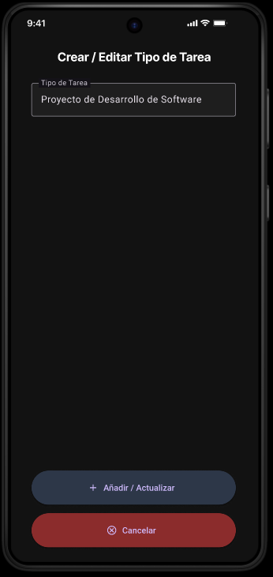

# Room Task APP
Room Task APP es una aplicación de gestión de tareas desarrollada en Kotlin para Android utilizando Jetpack Compose. Esta herramienta permite realizar operaciones CRUD (Crear, Leer, Actualizar, Eliminar) completas tanto para tareas como para tipos de tareas, ofreciendo una interfaz sencilla, intuitiva y agradable a la vista. La app está diseñada para facilitar el manejo de tus tareas de forma eficiente y organizada.

## Características principales
- **Gestión de tareas**: Crea, edita y elimina tareas según tus necesidades.
- **Gestión de tipos de tareas**: Organiza tus tareas agrupándolas por tipos personalizados.
- **Interfaz moderna**: Diseño limpio e intuitivo desarrollado con Jetpack Compose.
- **Reutilización de código**: Ventanas dinámicas para facilitar la experiencia del usuario y optimizar el rendimiento de la app.

## Boceto en Figma
### Pagina de Inicio
En esta ventana se muestran todas las tareas y los tipos de tareas segun el usuario qiera. También incluye un botón de acción flotante para agregar nuevas tareas o tipos de tareas.

### Pagina de Creacion / Edicion de Tareas
Esta ventana es reutilizada para dos propósitos: crear nuevas tareas o editar tareas existentes. Su diseño limpio y centrado en la experiencia del usuario asegura una interacción agradable. La reutilización de componentes contribuye a una mayor eficiencia y mantenibilidad del código.

### Pagina de Creacion / Edicion de TIpos de Tareas
Similar a la página anterior, esta ventana se utiliza para gestionar los tipos de tareas, permitiendo crear nuevos tipos o editar los ya existentes. La consistencia en el diseño garantiza una experiencia fluida para el usuario.

## Autor
- José Antonio Navarro Pérez